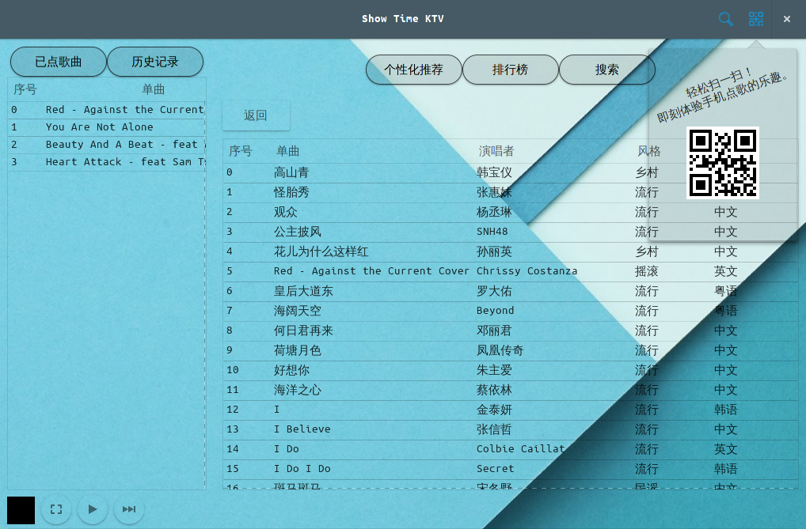
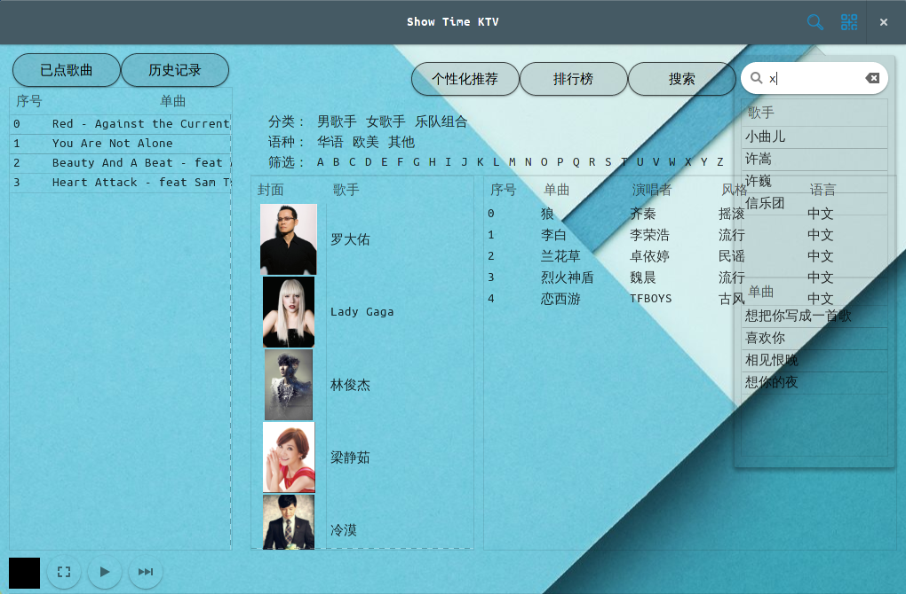
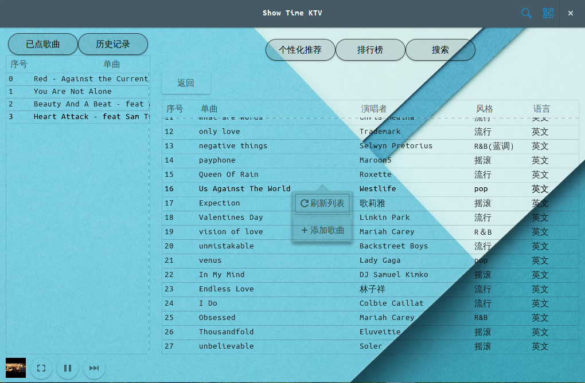
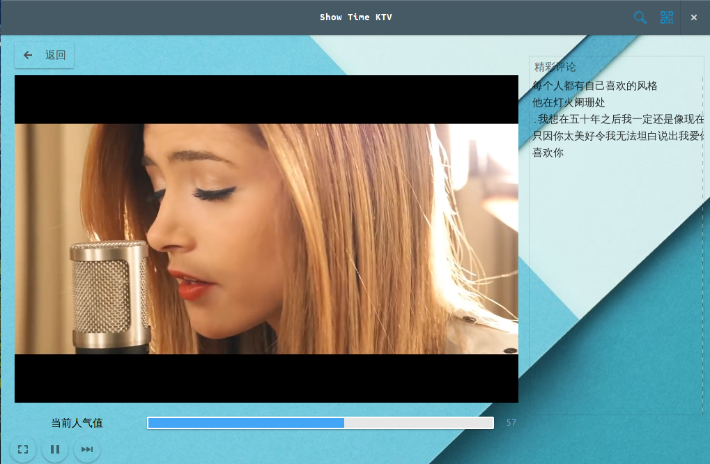

<h2>Table of Contents</h2>

<ul>
<li><a href="#orgheadline1">1. 这是什么？</a></li>
<li><a href="#orgheadline4">2. 加入开发需要具备什么条件？</a>
<ul>
<li><a href="#orgheadline2">2.1. 后台开发</a></li>
<li><a href="#orgheadline3">2.2. 桌面客户端开发</a></li>
</ul>
</li>
<li><a href="#orgheadline5">3. 如何开始后台开发？</a></li>
<li><a href="#orgheadline9">4. 开始桌面客户端的开发吧！</a>
<ul>
<li><a href="#orgheadline6">4.1. 依赖组件</a></li>
<li><a href="#orgheadline7">4.2. 快速体验</a></li>
<li><a href="#orgheadline8">4.3. 代码结构</a></li>
</ul>
</li>
<li><a href="#orgheadline10">5. 源码结构</a></li>
</ul>

# 这是什么？

Show Time KTV （STV）是一个多终端、多用户的 KTV 点歌系统。本项目处于激烈开发状态。欢迎有兴趣的同学加入。。。
这样该项目就会变得越来越强大，更加易用。

# 加入开发需要具备什么条件？

至少了解知道如下几个需要的东西。

## 后台开发

-   Python
-   MariaDB
-   Linux

## 桌面客户端开发

-   Python
-   Glade
-   GTK+-3.0
-   Gst+-1.0

# 如何开始后台开发？

    $ git clone https://github.com/RainMark/KTV.git
    $ cd KTV/SRC/DB

-   安装 Flask Web 框架。
-   配置 mariaDB 数据库，执行该目录下的 SQL 脚本（该脚本包含部分测试数据，用于开发过程中测试）。

    $ cd ../SVR

-   ktv.py 为后台主程序。
-   lib 包含 ktv.py 用到的一些模块（数据库相关、推荐系统相关）。

    $ python3 ktv.py

-   如果运行正常，恭喜你！尽情的修改代码吧！

# 开始桌面客户端的开发吧！

## 依赖组件

-   PyGObject Gtk+ 3.0
-   GStreamer Gst  1.0

## 快速体验

-   首先保证 SVR/ktv.py 后台服务已经运行起来。

    $ cd KTV/SRC/CLI
    $ python3 stv.py

-   如果没出现问题， 那么说明系统环境设置无误！NICE！

## 代码结构

-   stv.py 是程序入口，主要包含一个客户端类，以及相应类方法。实现 UI 的交互逻辑。
-   utils/stvvideo.py 主要实现播放器类。
-   utils/stvrequest.py 主要实现与后台数据交换。

# 源码结构

    .
    ├── CLI
    │   ├── glade
    │   │   ├── icons
    │   │   │   ├── bt_exit.png
    │   │   │   ├── bt_guess.png
    │   │   │   ├── bt_menu.png
    │   │   │   └── bt_random.png
    │   │   ├── main.css
    │   │   └── main.xml
    │   ├── stv.py
    │   └── util
    │       ├── __pycache__
    │       │   ├── stv_request.cpython-35.pyc
    │       │   └── stv_video.cpython-35.pyc
    │       ├── stv_request.py
    │       └── stv_video.py
    ├── DB
    │   └── KTV_DATABASE_SQL.sql
    └── SVR
        ├── __init__.py
        ├── ktv.py
        └── lib
            ├── database.py
            ├── __init__.py
            ├── __pycache__
            │   ├── database.cpython-35.pyc
            │   ├── __init__.cpython-35.pyc
            │   ├── recommendation.cpython-35.pyc
            │   ├── recommend.cpython-35.pyc
            │   └── server.cpython-35.pyc
            ├── recommendation.py
            └── server.py
    9 directories, 23 files